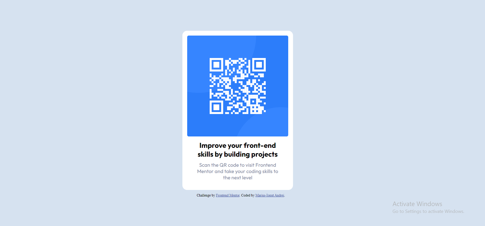

# Frontend Mentor - QR code component solution

This is a solution to the [QR code component challenge on Frontend Mentor](https://www.frontendmentor.io/challenges/qr-code-component-iux_sIO_H). Frontend Mentor challenges help you improve your coding skills by building realistic projects. 

## Table of contents

- [Overview](#overview)
  - [Screenshot](#screenshot)
  - [Links](#links)
- [My process](#my-process)
  - [Built with](#built-with)
  - [What I learned](#what-i-learned)
  - [Continued development](#continued-development)
  - [Useful resources](#useful-resources)
- [Author](#author)
- [Acknowledgments](#acknowledgments)

**Note: Delete this note and update the table of contents based on what sections you keep.**

## Overview

### Screenshot



### Links

- Solution URL: [Add solution URL here](https://your-solution-url.com)
- Live Site URL: [Add live site URL here](https://your-live-site-url.com)

## My process
1. I started with creating a style.css file and linked it in the head element of the. 
2. Created a clas named box so I can fit both paragraphs and image inside.
3. Created 2 seperate IDs for the 2 paragraph so I can style them separately.
4. Gave the html the proper width as it says in the style guide.
5. Change the color of the background to fit the solution.
6. Styled the box and the paragraphs to be equal to the requirements.
7. I added a media query to make the site fit for differrent screens, for which I used ChatGPT.
### Built with

- HTML5 
- CSS
- ChatGPT

### What I learned

I learned how to adjust the viewing of the site based on the device an user sees it. 

I don't have full knowledge of what "@media" is, but I it take as an evolution anyway.

```css
@media (max-width:375px)  {
    .box {
        margin-left: auto;
        margin-right: auto;
        width: 80%;
        margin-top: 50px;
    }
}
```


### Continued development

For this project I've used basic knowledge and it took me about an hour to finish. A little too long for such a small project, but 
am proud of it anyway. This project made me realise how cool and beautiful web developing can be. 

I hope in the future I will find a team of my liking with which I can grow and develop great skills in this area.


### Useful resources

-Udemy Course by dr.Angela Yu - She is my online mentor. All of my current and future work is made thanks to her. Great person, great mentor.

- ChatGPT (https://chat.openai.com) - This helped me with the last part on how to make the site automatically adjust based on the device.


## Author

- Website - [Marius-Ionut Andre](https://johnn0989.github.io/my-resume/) At the moment this is my site. 
- Frontend Mentor - [Johnn0989](https://www.frontendmentor.io/profile/Johnn0989)


## Acknowledgments

-dr.Angela Yu - She is my online mentor.

-W3Schools

-DevDocs

-ChatGPT - AI for everything

-Myself - I acknowledge myself because I couldn't do anything if it wasn't for me.


